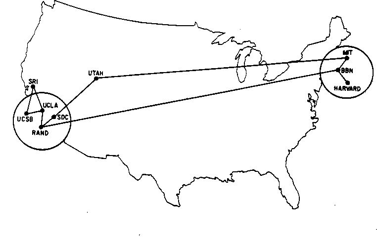
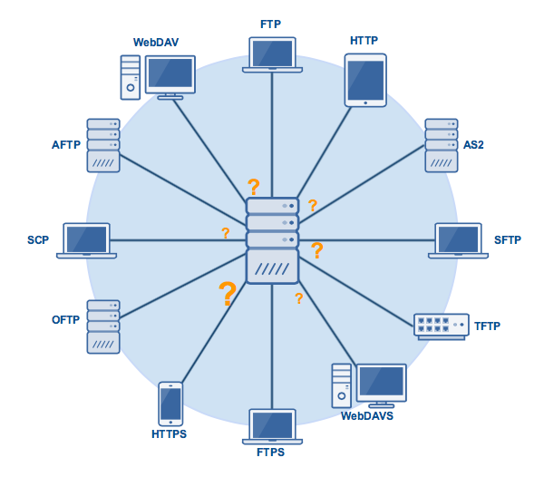

# Session 11 - Introduction to node.js, APIs, and Unity Web Requests

_Note 1: These are a very quick recap of the lesson. Please see me if you have questions._
_Note 2: I haven't included the socket.io stuff here yet. I want to go over that one more time in class before I post the notes. The below should be enough for your homework exercise_

## Problem to solve: I've got a computer over here. I've got another computer over there. How do we talk?
* How does the internet even work?
* The internet is built on standards, some of which have been around for 40+ years.

* ☝️ That is a map of ARPANET (the precursor to the modern internet) in June 1970. The original IP standards were developed then and haven't changed much. since.
    * More protocols have been built _on top of_ old protocols...

* ...like HTTP, which was developed by Tim Berners Lee in 1990 at CERN. That the same `http://.....` that we still use as a very common web protocol.
* These standards have enabled _more_ standards and will probably beget even more.
* From [Programming Sucks](https://www.stilldrinking.org/programming-sucks): 
    * _"...the truth is everything is breaking all the time, everywhere, for everyone. Right now someone who works for Facebook is getting tens of thousands of error messages and frantically trying to find the problem before the whole charade collapses. There’s a team at a Google office that hasn’t slept in three days. Somewhere there’s a database programmer surrounded by empty Mountain Dew bottles whose husband thinks she’s dead. And if these people stop, the world burns. Most people don’t even know what sysadmins do, but trust me, if they all took a lunch break at the same time they wouldn’t make it to the deli before you ran out of bullets protecting your canned goods from roving bands of mutants._    
    _You can’t restart the internet. Trillions of dollars depend on a rickety cobweb of unofficial agreements and “good enough for now” code with comments like “TODO: FIX THIS IT’S A REALLY DANGEROUS HACK BUT I DON’T KNOW WHAT’S WRONG” that were written ten years ago. I haven’t even mentioned the legions of people attacking various parts of the internet for espionage and profit or because they’re bored. Ever heard of 4chan? 4chan might destroy your life and business because they decided they didn’t like you for an afternoon, and we don’t even worry about 4chan because another nuke doesn’t make that much difference in a nuclear winter._    
    _On the internet, it’s okay to say, “You know, this kind of works some of the time if you’re using the right technology,” and BAM! it’s part of the internet now.....These things aren’t true because we don’t care and don’t try to stop them, they’re true because everything is broken because there’s no good code and everybody’s just trying to keep it running. That’s your job if you work with the internet: hoping the last thing you wrote is good enough to survive for a few hours so you can eat dinner and catch a nap._

* ☝️ A small set of possible protocols we can use to communicate between two computers.
* Let's just take a look at `HTTP`. What happens when you type an URL in the browser, from start to finish?
    * First, your browser takes a look at what you typed. 
        * Does it look like a URL? 
        * If not, let's just pass it along to a google search and make them deal with it (or bing 😭)
        * If yes, it builds the full, correct URL by prepending `http://`
    * DNS Lookup phase
        * The domain name is a handy shortcut for us humans. The _real_ location of anything connected to the internet is an `IP Address` - a numeric location addres.
        * The browser checks it's own internal cache first. If you've been to this address before, the browser will have saved the IP address so it can skip all the following steps
            * You can see this local cache if you're on chrome: [chrome://net-internals/#dns](chrome://net-internals/#dns)
        * If nothing is found there, the browser look to system. Your computer is also caching name-IP lookups
        * Still nothing? Then we have to go consult the big phonebooks in the cloud. DNS servers are special servers all over the world that keep track of which IP address (`35.185.221.152`) corresponds to which human-readable address (`woodbury.edu`)
            * There are 2 popular DNS servers:
                * `8.8.8.8`: the Google public DNS server
                * `1.1.1.1`: the CloudFlare DNS server
            * But most people use the DNS server provided by their internet provider.
        * The DNS server might have the domain IP in _it's_ cache. If not, it will ask the _root_ DNS server. That’s a system (composed of 13 actual servers, distributed across the planet) that drives the entire internet.
        * **The DNS server does not know the address of each and every domain name on the planet.**
            * What it knows is where the top-level DNS resolvers are.
            * A top-level domain is the domain extension: .com, .it, .pizza and so on.
                * forwards the request to that top-level domain (TLD) DNS server.
                * (think about allllll the `.com`s)
                * (Also, Now the previous DNS resolver will cache the IP of that TLD server, so it does not have to ask the root DNS server again for it.)
            * TLD server has the addesses for the actual **hosts**
    * Great! **That just got us to the IP address!**
        * Does that help?
        * What if I told you that **Woodbury's campus is all on _ONE_ ip address?**
            * (actually it might be on 2 or 3 or 10, but it's definitely got less IP addresses than computers).
        * Now we have to thing about _local_ routing, but I won't get into that here.
* The point is, that **There are a lot of steps to get to a given place on the internet.**
* And all of that has to happen in a few milliseconds or users get cranky!

## Problem part two: I've got a computer over here, and I want to talk to a computer over there..._But I don't know that computer's IP or address_
* What if I'm making a P2P chat program, or a multi-player game. How do I know the addresses of all my clients? How do I connect to them?

* It makes sense to have some sort of known layer in the middle.
    * Set up a server and ask all clients to connect to _that_. Now you can send stuff to the clients.

## Setting up a node.js server
* Install [node](https://nodejs.org/en/). Download the LTS release
* Open up `terminal` on your mac/linux computer, or `powershell` on your Windows computer.
    * Navigate to place where you want to create your project (perhaps a new folder)
    * type `npm init` to create a new project. Keep pressing `ENTER` to accept all the default values and confirm the new project.
        * This will create a `package.json` file, which keeps track of your project settings, such as which libraries you bring in.
    * Take a look at the [index.js](index.js) file included with these notes. Copy that into the same directory you just used to `init` the new project.
        * **Make sure to look at the comments inside that file for more details on what's going on**
    * back in your terminal/shell, type `node index.js`
    * you should now be able to go to your browser and type `http://localhost:3000` and see the output of your server
    * back in your terminal/shell, you can hit `CTRL-C` to stop the node server.
    * **Helpful note:=** Every time you make a change to your javascript file, you will need to stop and restart your node app to see those changes reflected.
        * You can make your life easier by installing [nodemon](https://nodemon.io/) (get it...NODE MONitor) with the command `npm install -g nodemon`
        * now **instead of** using `node index.js` you can run your app with `nodemon index.js`and it will automatically restart every time you change something in your app.

## Setting up an actually __useful__ node.js server
* Add the [express](https://expressjs.com/en/guide/using-middleware.html) routing middleware to your project by typing `npm install --save express`
    * This will let us do different things based on which _route_ a request comes in on:
        * http://localhost:3000/ vs http://localhost:3000/somethingElse vs http://localhost:3000/someOtherThing
    * Take a look at the [indexApi.js](indexApi.js) file included with these notes. Copy that into the same directory you've been using.
        * **Make sure to look at the comments inside that file for more details on what's going on**
    * back in your terminal/shell, type `node indexApi.js` or `nodemon indexApi.js`
        * you should now be able to go to your browser and type `http://localhost:3000` and see the output of your server
    * Congrats, you've just made your first **API!**
        * What is [API](https://www.wikiwand.com/en/Application_programming_interface)
        * It is an interface _into_ an app or software.
            * If you set up a server or library that does something, you most likely want to create and document a set of functions that people can use to actually incorporate your library or talk to your server.

## Problem part three: I've got a computer over here _running a Unity app_, and I want to talk to a computer over there..._
* Take a look at `ClickToCommunicate.cs` and the comments in there

## Resources
* [Unity Coroutine Tutorial](https://unity3d.com/learn/tutorials/topics/scripting/coroutines)
* [Pretty Good node.js Reference](https://medium.freecodecamp.org/the-definitive-node-js-handbook-6912378afc6e)
* [C# Unity Web Request Syntaxes](https://stackoverflow.com/questions/46003824/sending-http-requests-in-c-sharp-with-unity)
* [Programming Sucks](https://www.stilldrinking.org/programming-sucks)
* [History of TCP/IP Protocol](http://www.tcpipguide.com/free/t_TCPIPOverviewandHistory.htm)
* [Good Intro to JavaScript](https://flaviocopes.com/javascript-introduction/) (if you need a refresher)
* [Brief History of HTTP](https://hpbn.co/brief-history-of-http/)
* [Maps of Arpanet Through the Years](http://bpastudio.csudh.edu/fac/lpress/history/arpamaps/)
* [Different Protocol Types](https://www.jscape.com/blog/12-file-transfer-protocols-businesses)
